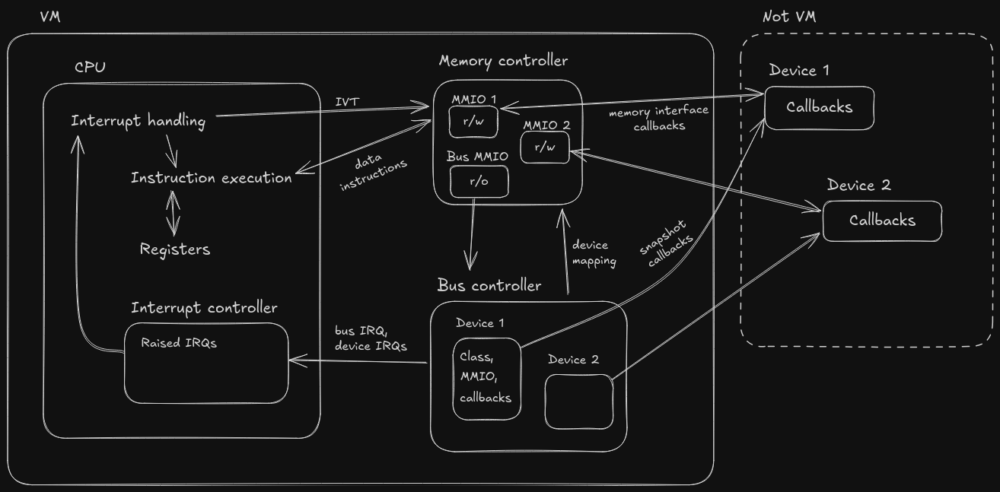

fcvm – a virtual machine for the Minecraft mod Fennel Computers.

Features:

* Small instruction set (37 instructions, 71 opcodes).
* Single address space with memory-mapped devices.
* Interrupts provided for the devices.
* Device enumeration using a memory-mapped bus controller.

